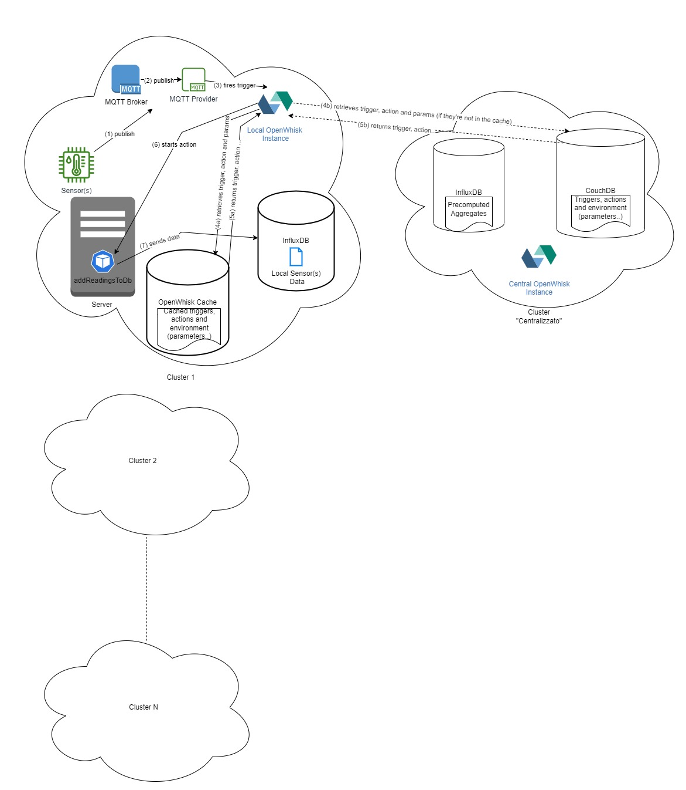

# Fog Computing for IoT devices using Apache OpenWhisk

|||
|:--:|:--:|
| **Author** | Giulia Bianchi|
| **Contact** | s294547@studenti.polito.it |

1. [Introduction](#introduction)
2. [Summary](#summary)
3. [Workflow summary](#workflow-summary)
4. [What still needs to be done](#what-still-needs-to-be-done)

## Introduction

This file will contain a summary of the work developed up to now to write my master thesis "Fog Computing for IoT devices using Apache OpenWhisk". I will first include a first summary of the achieved results, then I will birefly describe the workflow and what still has to be done.

## Summary

Let's present our use case: we are supposing to have multiple clusters, in particular multiple data centers, in which we want to monitor the temperature, gas percentual and humidity, so that we can constantly keep track its "health". 

Each data center has one or more ESP8266 provided with humidty, temperature and gas sensors. They publish data on given topics to a *local* MQTT broker, which is developed in the cluster as a pod. We'd like to write the published data on a local InfluxDB database everytime a new recording is done, but we don't want to do that with a container or a pod. This statement can be enforced by the fact that:

1. Scalability: OpenWhisk actions are designed to scale automatically based on the incoming workload. This means that as your sensor data grows, OpenWhisk can easily handle the increased load without requiring additional infrastructure or configuration. Running pods can also scale, but it requires more manual management, especially when dealing with multiple clusters.
2. Cost efficiency: By using OpenWhisk actions, you can leverage serverless computing and pay only for the compute resources you use. This can be more cost-efficient than running pods, which require managing and paying for the underlying infrastructure regardless of usage.

These are great advantages, but to understand better the advantages of the solution we have to go a little bit deeper in our solution. 

As we said, in **each** data center we have some sensors that publish data on given topics to a *local* MQTT broker, while a MQTT provider listens if data are published. When this is done, the provider fires a trigger interaction with the local OpenWhisk instance. The trigger is used to fire an OpenWhisk action, and in our case the Openwhisk action is a function that writes the published data on a local InfluxDB iinstance.  

In our architecture we have an OpenWhisk instance for each cluster. OpenWhisk needs a CouchDB database to store data related to the created triggers, actions ecc... : all the different OpenWhisk instances share the same CouchDB instance, which can be found in a "managment" centralized cluster. In this way, all the instances share the same actions and triggers and they only need to be configured **ONCE** for the entire architecture!

Going back to firing a trigger, when the trigger is fired the local OpenWhisk instance has two options:

1. The trigger hasn't been fired for a long time, so it must be retrieved from the centralized CouchDB with its parameters.
2. The trigger is in the local openwhisk cache, which is automatically created when deploying openwhisk (it is also possible to decide the cache expiration time), and it is retrieved from here. This is the scenario that should happen more frequently.

We really like this fact, because, since we are in a Fog Computing scenario, we want to confine the computation on the edge clusters, contacting as less ass possible the *centralied* cluster. It is also important to note that the centralized cluster *never* contacts the edge cluster if it is not consulted by them first, this is also enforced by some Network Policies automatically deployed by OpenWhisk.

After the trigger is retrieved, the same steps are followed to obtain the the action code and parameters. Once the local OpenWhisk instance has everything needed, it decided in which *invoker* create the pod that runs the action and is destroyed immediatly after terminating it. An invoker is just an available cluster node.

So, to summarize, I would say that the strenghts of this approach in our Fog Computing environment are:

1. Edge Computing: By confining the computation on the edge clusters, this approach reduces the need for centralized processing, thus enabling faster and more efficient data processing, as well as reducing latency and bandwidth usage.
2. Cost-efficiency: The use of serverless computing and paying only for the compute resources used can be more cost-efficient than running pods, which require managing and paying for the underlying infrastructure regardless of usage.
3. Centralized Management: The use of a centralized CouchDB database for storing data related to triggers, actions, etc. enables easy management and configuration of the OpenWhisk instances across multiple clusters, reducing the need for manual management in the different local instances and reducing the risk of errors.
4. Security: The deployment of Network Policies automatically by OpenWhisk helps to enforce security policies, preventing unauthorized access to edge clusters, while enabling data exchange and processing within the authorized nodes.
5. Performance: OpenWhisk's caching mechanisms can improve response times and lower latency, enabling faster and more efficient processing of data at the edge.
6. Reduced Network Traffic: By leveraging caching mechanisms, less network traffic is required between edge clusters and centralized resources, reducing bandwidth usage and improving overall network efficiency.

Overall, leveraging OpenWhisk for edge device monitoring can be optimized for fog computing environments, enabling computation to be confined on the edge clusters and minimizing communication with centralized resources.

Another functionality has been implementes: some daily aggregates are computed on the collected data for each local cluster and they are finally sent on a InfluxDB database on the centralized cluster. The operation of computing the aggregates is done with an action also in this case and the trigger related to it is fired with an Alarm Provider, which is natively provided when deployin OpenWhisk.

## Workflow summary

I'd like to spend some words on the workflow followed to develop everything I've done up to now.

At first, I wasn't so sure which FaaS tool i would have used, so I made some researches about the available tools, even the ones provided by cloud provideres like AWS, Microsoft Azure, ecc... 

After a deep comparison, I decided to use OpenWhisk, since it has multiple advantages and a clear documentation.

I started then with small steps, working in a single cluster environment: i first deployed Openwhisk and tried to fire some actions. Then, I developed my own CouchDB instance and I re-deployed Openwhisk in order to use it, without creating its own CouchDB. 

I first tried to set up the solution in a single-cluster environment, omitting temporarily the Fog Computing architecture. I've been working on a Kubernetes Cluster, where I set up a pod emulating a device publishing data to an MQTT broker on a given topic and the relative MQTT broker. I also deployed a local InfluxDB instance and then I tried creating the trigger and the action to write published data on the InfluxDB, but to fire the trigger I also needed to deploy an MQTT Provider.

After this, I started using a real ESP8266 device, so I wrote its code with Arduino in order to make it publish data to the MQTT broker. 

When I got the first action working, I needed to create the second action that computes the aggregates and sends them to a centralized InfluxDB, so I had to deploy another instance of it.  

During this steps I deployed everythin in different namespaces: *openwhisk*, *mosquitto*,  *influxdb*, *influxdb-centralized*, *couchdb-external*. 

After testing this single-cluster solution, I managed to test the solution on a multiple cluster environment. To do that, I re-arranged the namespacing rules: insted of assigning a different namespace for each application or specific tool, i created a namespace for each *cluster*. In particular, in each namespace we can find the OpenWhisk deployment, InfluxDB, the MQTT broker and provider, while in the namespace related to the *centralized* cluster we can find the OpenWhisk deployment, InfluxDB and CouchDB. By organizing the namespaces in this way, I can call the different services like InfluxDB and OpenWhisk API Frontend in the same way, avoinding the use of customized paramters for each local data center and enforcing a standardization of the solution.

I also tried to set connect my device to an Azure IoTHub and to fire an Azure Function whenever new data are published, just for the sake of curiosity.

## What still needs to be done

Up to now, some things still need to be done:

 - I have to correct and add some things to the arduino project of the sensor
 - I have to develop an helm chart that automates the deployment of the entire solution (both for the local instances and the central instance)
 - I have to check everything again to discover some little errors

