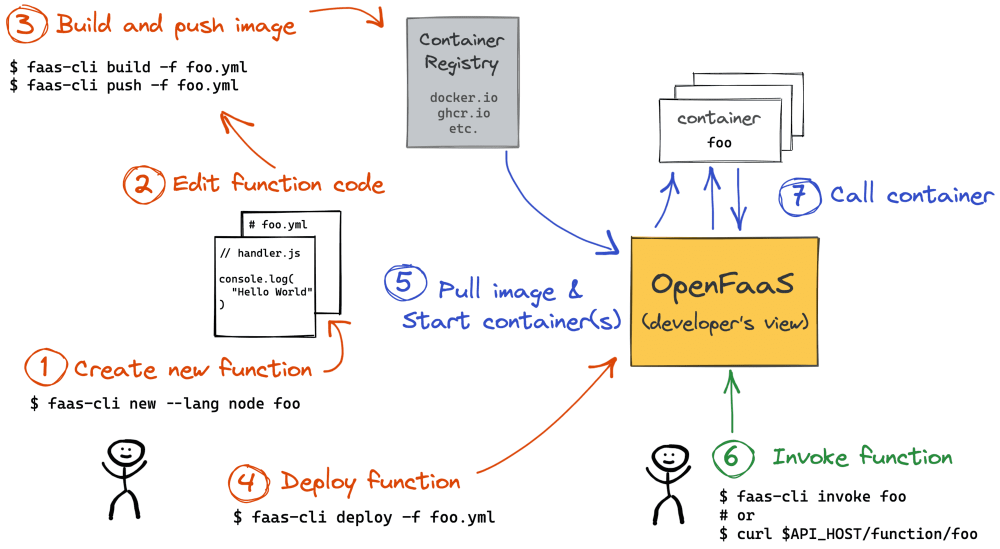
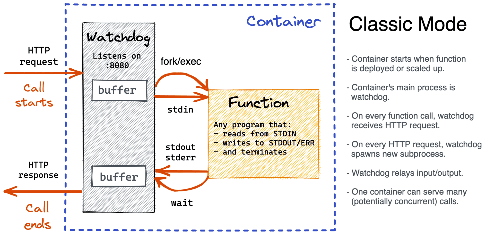
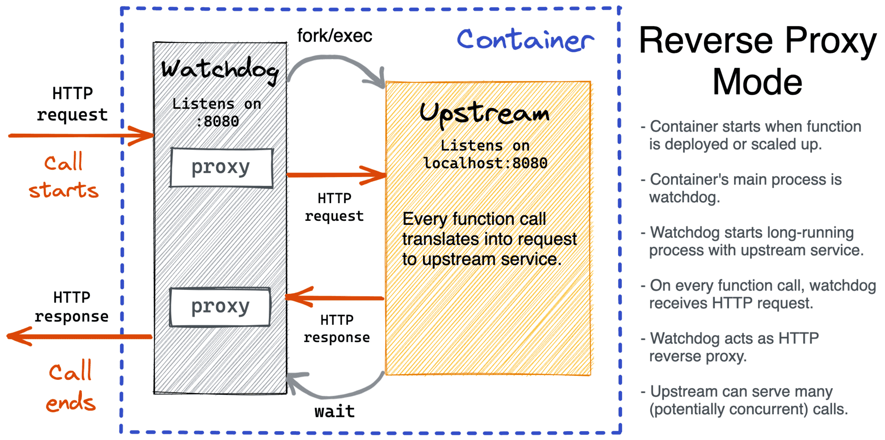

# DISCOVERING AND COMPARING FaaS TOOLS

<div style="margin-left: auto;
            margin-right: auto;
            width: 50%">

|||
|:--:|:--:|
| **Author** | Giulia Bianchi|
| **Contact** | s294547@studenti.polito.it |
</div>

1. [What is Faas](#what-is-faas)
	1. [Limtations](#limitations)
2. [IoT and FaaS](#iot-and-faas)
	1. [OpenFaas](#openfaas)
	2. [OpenWhisk](#openwhisk)
	3. [Knative](#knative)
3. [Supported Languages](#supported-languages)
	1. [OpenFaas](#openfaas-1)
	2. [OpenWhisk](#openwhisk-1)
	3. [Knative](#knative-1)
4. [Creating a Function](#creating-a-function)
	1. [OpenFaas](#openfaas-2)
	2. [OpenWhisk](#openwhisk-2)
	3. [Knative](#knative-2)
5. [The cost of running a function and possible optimizations](#the-cost-of-running-a-function-and-possible-optimizations)
	1. [OpenFaas](#openfaas-3)
	2. [OpenWhisk](#openwhisk-3)
	3. [Knative](#knative-3)
6. [Running Functions](#running-functions)
	1. [OpenFaas](#openfaas-4)
	2. [OpenWhisk](#openwhisk-4)
	3. [Knative](#knative-4)
7. [Autoscaling] (#autoscaling)
	1. [OpenFaas](#openfaas-5)
	2. [OpenWhisk](#openwhisk-5)
	3. [Knative](#knative-5)
8. [Summary Matrix](#summary-matrix)
9. [Resources](#resources)


## What is FaaS

FaaS is about running backend code without managing your own server systems or your own long-lived server applications. That second clause—long-lived server applications—is a key difference when comparing with other modern architectural trends like containers and PaaS (Platform as a Service).

FaaS offerings do not require coding to a specific framework or library. FaaS functions are regular applications when it comes to language and environment. For instance, AWS Lambda functions can be implemented “first class” in Javascript, Python, Go, any JVM language (Java, Clojure, Scala, etc.), or any .NET language. However your Lambda function can also execute another process that is bundled with its deployment artifact, so you can actually use any language that can compile down to a Unix process (see Apex, later in this article).

Deployment is very different from traditional systems since we have no server applications to run ourselves. In a FaaS environment we upload the code for our function to the FaaS provider, and the provider does everything else necessary for provisioning resources, instantiating VMs, managing processes, etc.

**Horizontal scaling is completely automatic, elastic, and managed by the provider.** If your system needs to be processing 100 requests in parallel the provider will handle that without any extra configuration on your part. The “compute containers” executing your functions are ephemeral, with the FaaS provider creating and destroying them purely driven by runtime need. Most importantly, with FaaS the vendor handles all underlying resource provisioning and allocation—no cluster or VM management is required by the user at all.

Functions in FaaS are typically triggered by event types defined by the provider. With Amazon AWS such stimuli include S3 (file/object) updates, time (scheduled tasks), and messages added to a message bus (e.g., Kinesis).

Most providers also allow functions to be triggered as a response to inbound HTTP requests; in AWS one typically enables this by way of using an API gateway.

### Limitations

#### State

FaaS functions have significant restrictions when it comes to local (machine/instance-bound) state—i.e., data that you store in variables in memory, or data that you write to local disk. You do have such storage available, but you have no guarantee that such state is persisted across multiple invocations, and, more strongly, you should not assume that state from one invocation of a function will be available to another invocation of the same function. FaaS functions are therefore often described as stateless, but it’s more accurate to say that any state of a FaaS function that is required to be persistent needs to be externalized outside of the FaaS function instance.

#### Execution Duration

FaaS functions are typically limited in how long each invocation is allowed to run. At present the “timeout” for an AWS Lambda function to respond to an event is at most five minutes, before being terminated. Microsoft Azure and Google Cloud Functions have similar limits.

This means that certain classes of long-lived tasks are not suited to FaaS functions without re-architecture—you may need to create several different coordinated FaaS functions, whereas in a traditional environment you may have one long-duration task performing both coordination and execution.

#### Startup latency and “cold starts”
It takes some time for a FaaS platform to initialize an instance of a function before each event. This startup latency can vary significantly, even for one specific function, depending on a large number of factors, and may range anywhere from a few milliseconds to several seconds. That sounds bad, but let’s get a little more specific, using AWS Lambda as an example.

Initialization of a Lambda function will either be a “warm start”—reusing an instance of a Lambda function and its host container from a previous event—or a “cold start” —creating a new container instance, starting the function host process, etc. Unsurprisingly, when considering startup latency, it’s these cold starts that bring the most concern.

Cold-start latency depends on many variables: the language you use, how many libraries you’re using, how much code you have, the configuration of the Lambda function environment itself, whether you need to connect to VPC resources, etc. Many of these aspects are under a developer’s control, so it’s often possible to reduce the startup latency incurred as part of a cold start.

Equally as variable as cold-start duration is cold-start frequency. For instance, if a function is processing 10 events per second, with each event taking 50 ms to process, you’ll likely only see a cold start with Lambda every 100,000–200,000 events or so. If, on the other hand, you process an event once per hour, you’ll likely see a cold start for every event, since Amazon retires inactive Lambda instances after a few minutes. Knowing this will help you understand whether cold starts will impact you on aggregate, and whether you might want to perform “keep alives” of your function instances to avoid them being put out to pasture.

#### Comparison with PaaS

**Given that Serverless FaaS functions are very similar to Twelve-Factor applications, are they just another form of "Platform as a Service" (PaaS)?**

Most PaaS applications are not geared towards bringing entire applications up and down in response to an event, whereas FaaS platforms do exactly this.

The key operational difference between FaaS and PaaS is scaling. Generally with a PaaS you still need to think about how to scale—for example, with Heroku, how many Dynos do you want to run? With a FaaS application this is completely transparent. Even if you set up your PaaS application to auto-scale you won’t be doing this to the level of individual requests (unless you have a very specifically shaped traffic profile), so a FaaS application is much more efficient when it comes to costs.

## IoT and FaaS

### OpenFaaS

OpenFaaS can be a good fit for IoT (Internet of Things) use cases for several reasons:

1. Low resource footprint: OpenFaaS is designed to have a low resource footprint, making it well-suited for IoT devices that may have limited CPU, memory, or storage capacity.
2. Easy deployment and management: OpenFaaS provides a simple and easy-to-use interface for deploying and managing functions, which can be especially important in an IoT context where devices may be located in remote or hard-to-reach locations.
3. Scalability: OpenFaaS provides built-in support for horizontal scaling, which can be useful in IoT environments where the number of devices and the volume of data being generated can vary significantly over time.
4. Flexibility: OpenFaaS supports multiple programming languages and runtimes, making it easy to develop and deploy functions in a variety of environments.
5. Integration with other tools: OpenFaaS can be easily integrated with other tools and services, such as messaging platforms, event-driven architectures, and serverless databases, which can be useful in IoT contexts where data needs to be processed and analyzed in real time.

Overall, OpenFaaS can provide a flexible, lightweight, and easy-to-manage platform for running functions in an IoT environment, making it a good choice for organizations looking to build scalable and efficient IoT applications.

### OpenWhisk

Internet of Things scenarios are often inherently sensor-driven. For example, an action in OpenWhisk might be triggered if there is a need to react to a sensor that is exceeding a particular temperature. IoT interactions are usually stateless with potential for very high level of load in case of major events (natural disasters, significant weather events, traffic jams, etc.) This creates a need for an elastic system where normal workload might be small, but needs to scale very quickly with predictable response time and ability to handle extremely large number of events with no prior warning to the system. It is very hard to build a system to meet these requirements using traditional server architectures as they tend to either be underpowered and unable to handle peak in traffic or be over-provisioned and extremely expensive.

### Knative

Knative is a popular open-source platform for building and running serverless applications on top of Kubernetes. While Knative was not specifically designed for IoT (Internet of Things), it can be a good fit for IoT use cases for a few reasons:
1. Scalability: Knative provides a platform for automatically scaling applications based on incoming traffic. For IoT applications that experience large, unpredictable spikes in traffic (such as a sudden influx of data from multiple devices), Knative can ensure that the application can handle the increased load without manual intervention.
2. Resource efficiency: Because Knative is built on top of Kubernetes, it can leverage Kubernetes' efficient use of compute resources. This can be particularly important for IoT applications, which often have limited resources available for compute and storage.
3. Event-driven architecture: Knative is designed to support event-driven architectures, which makes it well-suited for IoT applications that rely on data streaming from multiple devices. Knative can consume and process incoming events from IoT devices, and then trigger serverless functions to handle the events in real-time.
4. Openness: Knative is an open-source platform, which means it is not tied to any specific cloud provider or IoT platform. This gives IoT developers the freedom to choose the best components and services for their particular use case, and to easily move their applications between different clouds or edge environments.

## Supported Languages

### OpenFaaS
Functions can be written in any language, and are built into portable OCI images.

We have official templates available for: Go, Java, Python, C#, Ruby, Node.js, PHP, or you can write your own.

So, functions can be created with any language if using a dockerfile.

### OpenWhisk
Actions can be small snippets of code (JavaScript, Swift and many other languages are supported), or custom binary code embedded in a Docker container.
The following is a list of runtimes the Apache OpenWhisk project has officially released:
**.Net** - OpenWhisk runtime for .Net Core 2.2
**Go** - OpenWhisk runtime for Go
**Java** - OpenWhisk runtime for Java 8 (OpenJDK 8, JVM OpenJ9)
**JavaScript** - OpenWhisk runtime for Node.js v10, v12 and v14
**PHP** - OpenWhisk runtime for PHP 8.0, 7.4 and 7.3
**Python** - OpenWhisk runtime for Python 2.7, 3 and a 3 runtime variant for AI/ML (including packages for Tensorflow and PyTorch)
**Ruby** - OpenWhisk runtime for Ruby 2.5
**Swift** - OpenWhisk runtime for Swift 3.1.1, 4.1 and 4.2

If you need languages or libraries the current "out-of-the-box" runtimes do not support, you can create and customize your own executable that run "black box" Docker Actions using the Docker SDK which are run on the Docker Runtime.

### Knative

To create a function you need to create a Knative service (which is a CRD), by applying a YAML file. In the YAML file there is the Image specification, so, basically any kind of language is supported, as long as you can put the wanted function inside a contianer image.

Additionaly, Knative offers with Knative Functions a simple programming model for using functions on Knative, without requiring in-depth knowledge of Knative, Kubernetes, containers, or dockerfiles. Knative Functions provides templates that can be used to create basic functions, by initiating a function project boilerplate when you run a create command.

Templates allow you to choose the language and invocation format for your function. The following templates are available with both CloudEvent and HTTP invocation formats:
1. Node.js
2. Python
3. Go
4. Quarkus
5. Rust
6. Spring Boot
7. TypeScript

## Creating a Function
### OpenFaaS
#### Building Images

Openfaas functions run in containers, someone (or something) needs to build images for these containers. And like it or not, the responsibility lies on developers. OpenFaaS provides a handy faas-cli build command but no server-side builds. So, you either need to run faas-cli build manually (from a machine running Docker) or teach your CI/CD how to do it.

Built images then need to be pushed with faas-cli push to a registry. Obviously, such a registry should be reachable from the OpenFaaS server-side as well. Otherwise, trying to deploy a function with faas-cli deploy will fail.

#### Watchdog
OpenFaaS functions are run in containers, and every such container must conform to a simple convention - it must act as an HTTP server listening on a predefined port (8080 by default), assume ephemeral storage, and be stateless.

However, OpenFaaS offloads the need to write such servers from users through the function watchdog pattern. A function watchdog is a lightweight HTTP server with the knowledge on how to execute the actual function's business logic. So, everything installed in a container plus such a watchdog as its entrypoint will constitute the function's runtime environment.

##### Classic WatchDog


##### Reverse Proxy Watchdog


#### Resources created i kubernetes
When using Kubernetes, each function you deploy through the OpenFaaS API **will create a separate Kubernetes Deployment object**. Deployment objects have a "replicas" value which corresponds to the number of Pods created in the cluster, that can serve traffic for your function.

A Kubernetes Service object is also created and is used to access the function's HTTP endpoint on port 80, within the cluster.

By default, all functions have a minimum of 1 replica set through auto-scaling labels, this can prevent a so called "cold-start", where a deployment is set to 0 replicas, and a Pod needs to be created to serve an incoming request.

**The Scale to Zero functionality of OpenFaaS Pro can be used to scale idle functions down to 0 replicas, to save on resources.**

### OpenWhisk
#### Creation of an Action

To give the explanation a little bit of context, let’s create an action in the system first. We will use that action to explain the concepts later on while tracing through the system. The following commands assume that the OpenWhisk CLI is setup properly.

First, we’ll create a file action.js containing the following code which will print “Hello World” to stdout and return a JSON object containing “world” under the key “hello”.

```
function main() {
    console.log('Hello World');
    return { hello: 'world' };
}
```
We create that action using.

```
wsk action create myAction action.js
```
Done. Now we actually want to invoke that action:

```
wsk action invoke myAction --result
```

#### The internal flow of processing


##### Entering the system: nginx
First: OpenWhisk’s user-facing API is completely HTTP based and follows a RESTful design. As a consequence, the command sent via the wsk CLI is essentially an HTTP request against the OpenWhisk system. The specific command above translates roughly to:

```
POST /api/v1/namespaces/$userNamespace/actions/myAction
Host: $openwhiskEndpoint
```
Note the $userNamespace variable here. A user has access to at least one namespace. For simplicity, let’s assume that the user owns the namespace where myAction is put into.

The first entry point into the system is through nginx, “an HTTP and reverse proxy server”. It is mainly used for SSL termination and forwarding appropriate HTTP calls to the next component.

##### Entering the system: Controller

Not having done much to our HTTP request, nginx forwards it to the Controller, the next component on our trip through OpenWhisk. It is a Scala-based implementation of the actual REST API (based on Akka and Spray) and thus serves as the interface for everything a user can do, including CRUD requests for your entities in OpenWhisk and invocation of actions (which is what we’re doing right now).

The Controller first disambiguates what the user is trying to do. It does so based on the HTTP method you use in your HTTP request. As per translation above, the user is issuing a POST request to an existing action, which the Controller translates to an invocation of an action.

Given the central role of the Controller (hence the name), the following steps will all involve it to a certain extent.

##### Authentication and Authorization: CouchDB

Now the Controller verifies who you are (Authentication) and if you have the privilege to do what you want to do with that entity (Authorization). The credentials included in the request are verified against the so-called subjects database in a CouchDB instance.

In this case, it is checked that the user exists in OpenWhisk’s database and that it has the privilege to invoke the action myAction, which we assumed is an action in a namespace the user owns. The latter effectively gives the user the privilege to invoke the action, which is what he wishes to do.

As everything is sound, the gate opens for the next stage of processing.

##### Getting the action: CouchDB… again

As the Controller is now sure the user is allowed in and has the privileges to invoke his action, it actually loads this action (in this case myAction) from the whisks database in CouchDB.

The record of the action contains mainly the code to execute (shown above) and default parameters that you want to pass to your action, merged with the parameters you included in the actual invoke request. It also contains the resource restrictions imposed on it in execution, such as the memory it is allowed to consume.

In this particular case, our action doesn’t take any parameters (the function’s parameter definition is an empty list), thus we assume we haven’t set any default parameters and haven’t sent any specific parameters to the action, making for the most trivial case from this point-of-view.

##### Who’s there to invoke the action: Load Balancer

The Load Balancer, which is part of the Controller, has a global view of the executors available in the system by checking their health status continuously. Those executors are called Invokers. The Load Balancer, knowing which Invokers are available, chooses one of them to invoke the action requested.

##### Please form a line: Kafka

From now on, mainly two bad things can happen to the invocation request you sent in:

1. The system can crash, losing your invocation.
2. The system can be under such a heavy load, that the invocation needs to wait for other invocations to finish first.
The answer to both is Kafka, “a high-throughput, distributed, publish-subscribe messaging system”. Controller and Invoker solely communicate through messages buffered and persisted by Kafka. That lifts the burden of buffering in memory, risking an OutOfMemoryException, off of both the Controller and the Invoker while also making sure that messages are not lost in case the system crashes.

To get the action invoked then, the Controller publishes a message to Kafka, which contains the action to invoke and the parameters to pass to that action (in this case none). This message is addressed to the Invoker which the Controller chose above from the list of available invokers.

Once Kafka has confirmed that it got the message, the HTTP request to the user is responded to with an ActivationId. The user will use that later on, to get access to the results of this specific invocation. Note that this is an asynchronous invocation model, where the HTTP request terminates once the system has accepted the request to invoke an action. A synchronous model (called blocking invocation) is available, but not covered by this article.

##### Actually invoking the code already: Invoker
The Invoker is the heart of OpenWhisk. The Invoker’s duty is to invoke an action. It is also implemented in Scala. But there’s much more to it. To execute actions in an isolated and safe way it uses Docker.

**Docker is used to setup a new self-encapsulated environment (called container) for each action that we invoke in a fast, isolated and controlled way. In a nutshell, for each action invocation a Docker container is spawned, the action code gets injected, it gets executed using the parameters passed to it, the result is obtained, the container gets destroyed. This is also the place where a lot of performance optimization is done to reduce overhead and make low response times possible.**

In our specific case, as we’re having a Node.js based action at hand, the Invoker will start a Node.js container, inject the code from myAction, run it with no parameters, extract the result, save the logs and destroy the Node.js container again.

##### Storing the results: CouchDB again

As the result is obtained by the Invoker, it is stored into the activations database as an activation under the ActivationId mentioned further above. The activations database lives in CouchDB.

In our specific case, the Invoker gets the resulting JSON object back from the action, grabs the log written by Docker, puts them all into the activation record and stores it into the database. It will look roughly like this:

```
{
   "activationId": "31809ddca6f64cfc9de2937ebd44fbb9",
   "response": {
       "statusCode": 0,
       "result": {
           "hello": "world"
       }
   },
   "end": 1474459415621,
   "logs": [
       "2016-09-21T12:03:35.619234386Z stdout: Hello World"
   ],
   "start": 1474459415595,
}
```
Note how the record contains both the returned result and the logs written. It also contains the start and end time of the invocation of the action. There are more fields in an activation record, this is a stripped down version for simplicity.

Now you can use the REST API again (start from step 1 again) to obtain your activation and thus the result of your action. To do so you’d use:
```
wsk activation get 31809ddca6f64cfc9de2937ebd44fbb9
```

### Knative

#### How to create a function

To create a function with Knative, we need to do the following steps:
1. Write your function code: First, you need to write the code for your function in your preferred programming language. Knative supports several programming languages, such as Node.js, Python, Java, and Go.
2. Create a Docker image of your function: Once you have written your function code, you need to create a Docker image of your function. The Docker image contains your function code and all its dependencies. You can create the Docker image by writing a Dockerfile, which describes how to build the image. You can also use an existing image and add your function code to it.
3. Push the Docker image to a container registry: After you have created the Docker image, you need to push it to a container registry such as Docker Hub or Google Container Registry. The container registry is used to store and distribute your Docker images.
4. Create a Knative Service: Once your Docker image is in a container registry, you can create a Knative Service that represents your function. A Knative Service is a Kubernetes custom resource that defines your function's deployment, scaling, and network settings. You can create a Knative Service using the kubectl command-line tool or by writing a YAML manifest file.
5. Deploy the Knative Service: Once you have created the Knative Service, you can deploy it by running the *kubectl apply* command. This will create the necessary Kubernetes resources, such as Deployments, Services, and ConfigMaps, to run your function.
6. Invoke your function: After your function is deployed, you can invoke it by sending HTTP requests to its endpoint. The endpoint is a stable network address that Knative creates for your function. You can also configure event sources to trigger your function in response to specific events.

#### What happens when a function is created?
When you create a function with Knative, the following happens:

1. Knative creates a Kubernetes Deployment to manage the function instances. The Deployment ensures that the desired number of function instances are running and replaces any failed instances.
2. Knative creates a Kubernetes Service to provide a stable network endpoint for the function instances. The Service allows clients to access the function using a single DNS name.
3. Knative creates an Istio Virtual Service to manage the traffic routing to the function instances. The Virtual Service can distribute traffic based on various criteria, such as HTTP headers or weights.
4. Knative sets up the autoscaling and scaling policies for the function. Knative uses the metrics specified in the Knative Service manifest to determine when to scale the function instances up or down.
5. Knative creates a revision of the function code for the Knative Service. A revision is a snapshot of the function code, configuration, and network settings. You can use revisions to perform canary or blue-green deployments.

When you create a function in Knative, by default, no containers are created initially.

When you create a Knative Service, Knative creates a Kubernetes Deployment object to manage the function instances. The Deployment specifies the desired number of replicas (i.e., function instances) to be created. However, Kubernetes does not create all replicas immediately, but gradually over time, as needed.

When a request is made to your function, Knative's scaling controller checks if there are enough function instances running to handle the request. If there are not enough instances, the controller creates new instances until the desired number of replicas is reached.

The number of function instances that are created depends on the scaling policies specified in your Knative Service manifest. Knative supports several scaling policies, such as based on CPU utilization or incoming requests. You can configure the scaling policies according to your requirements.

## The cost of running a function and possible optimizations

### OpenFaaS
Let’s look at the lifecycle of a container, or as I like to call it “Why is this thing so slow?”

There’s several things that happen when a container is scheduled on Kubernetes:

1.The container image has to be fetched from a remote registry
2.The container has to be scheduled on a node with available resources
3.The container has to be started and have its endpoint registered for health checks
4.A health check has to pass for the container’s endpoint
And when all that’s complete, you can probably serve a request.


So I tried it out, and found that this process would take several seconds, even for small container images, or images that were already cached on my cluster.

Why was that? Primarily because the health checks in Kubernetes at a minimum of every 1 second, so if you miss the first, you have to wait for the second to pass. Thus you get your 2 second latency for a cold-start.

Container should be created at deployment time, and perhaps we should use process-level isolation instead, so we add a Watchdog in each contianer. The OpenFaaS watchdog creates a process per request.

To re-use the same process instead,  the of-watchdog was created and added HTTP-level multiplexing for requests.


Scaling up from zero replicas or 0/0 can be toggled through the scale_from_zero environment variable for the OpenFaaS Gateway. This is turned on by default on Kubernetes and faasd.

The latency between accepting a request for an unavailable function and serving the request is sometimes called a "Cold Start".

**What if I don't want a "cold start"?**

The cold start in OpenFaaS is strictly optional and it is recommended that for time-sensitive operations you avoid one by having a minimum scale of 1 or more replicas. This can be achieved by not scaling critical functions down to zero replicas, or by invoking them through the asynchronous route which decouples the request time from the caller.


### OpenWhisk

The Invoker is arguably the heart of OpenWhisk. It’s responsible for making sure your code actually runs. Its also the component which produces by far the most overhead in the system, latency-wise.

As the architecture chart indicates, the Invoker works by talking to docker. We use docker to containerize each action to be able to provide multi-tenant execution where different users do not impact each other. Containers give a convenient mechanism to “blindly” run untrusted code while having the tools at hand to prevent this code from doing bad things.

Inside those containers, OpenWhisk uses a small HTTP server to provide two endpoints, /init and /run. Those endpoints inject the action code into the container and run it respectively. /init takes the action’s code and does whatever is necessary to make this code a runnable entity. In Node.js the code is simply interpreted, but Swift for example even compiles the code. You get the idea. It’s also clear now: Initializing a container can come at a cost! After initialization was successful, /run is used to pass arguments to the action and execute it.

The critical path for a container involves the following steps:

1. Starting the container via docker run. As we’re doing HTTP calls to that container, we also get the container’s IP address via docker inspect.
2. Initializing the container with the action that was given by the user via /init.
3. Run the action via /run.
If you need to go through all those steps, we speak of a cold container.

In the grand total, to perfrom an action we need to do:

1. 2 docker commands: docker run and docker inspect. The former alone takes around 300 milliseconds to do its job.
2. 2 HTTP calls: /init and /run. The latency of initialization highly depends on the runtime used and the amount of code you want to run. The latency of running the code itself is determined by the task at hand.
3. 2 Kafka messages: the “job” message and the response message. They usually add less than 5 milliseconds of latency.
4. 3 database calls: authentication, get the action in the controller, get the action in the invoker. The latency here depends on where you host the database and how large the entities are of course.

Let’s see how we can optimize the overhead away, step by step.

**Good old caching**
To reduce the overhead of database calls we use in-memory caching. That’s all. At a steady state and if you bring a lot of load to the system there won’t be any call to a database on your critical path. By using caches we completely take the database out of the game.

**Container reuse**

One of the most obvious mechanisms to reduce the overhead is to completely take the containerization system out of the game. In this case, that means again: caching. Or container-reuse. If a user fires the same action twice, and the first action has already finished, we can just use the same container again. Per the steps mentioned above, that will spare us the docker run and the HTTP call to initialize the action. In OpenWhisk we call this a warm container. Warm containers are the best you can get in terms of latency and throughput. The more load you impose on the system, the more warm containers you will have.

Doing the math, for a warm invocation we completely avoid the docker commands needed to start a container as it already exists. The /init call vanishes as well. We’re left with 1 HTTP call (/run) and our 2 Kafka messages on the critical path. That’s as close to your application latency (determined by /run) as it gets.

**Container prewarming**

Warm containers do not solve the “cold-start” latency problem though. That is the effect of the very first invocation of an action taking awfully long. To address this, OpenWhisk spawns so-called prewarmed containers. For example, let’s assume that the majority of all requests use Node.js based actions. As a consequence, OpenWhisk can spawns some Node.js containers, anticipating user load.

That has the effect of reducing cold-start latency by quite a bit as it eliminates the most expensive operation we have (docker run) and takes it off the critical path. That leaves us with 2 HTTP calls (/init and /run) plus the 2 Kafka messages on the critical path for an invocation using a prewarmed container.

### Knative

Knative Serving uses containers to package and run serverless functions. When a new request comes in, Knative Serving creates a new container and deploys the serverless function inside it. The container then runs the function, and sends the response back to the user.

The critical path for a serverless function on Knative involves the following steps:

1. Starting a new container.
2. Deploying the serverless function inside the container.
3. Running the serverless function.
4. Responding to the user's request.
To reduce the overhead of starting a new container for each request, Knative Serving provides several features that can help optimize the critical path.

**Container reuse**

Similar to OpenWhisk, Knative Serving provides container reuse, which means that if a new request comes in and a container is already running with the serverless function deployed inside it, Knative Serving will reuse that container. This approach saves the overhead of creating a new container, deploying the function inside it, and starting the container.

**Container prewarming**

To further reduce cold-start latency, Knative Serving also provides container prewarming. This feature allows developers to create prewarmed containers that are ready to run the serverless function. Prewarmed containers can help reduce the overhead of starting a new container, as they are already running and have the serverless function deployed inside them.

**Autoscaling**

Knative Serving also provides autoscaling, which allows developers to automatically scale the number of containers based on the incoming traffic. Autoscaling can help ensure that there are enough containers available to handle the incoming requests, and can help reduce the overhead of starting new containers.

Overall, Knative Serving provides several features that can help optimize the critical path for running serverless functions, including container reuse, container prewarming, and autoscaling. These features can help reduce the overhead of starting new containers and deploying serverless functions inside them, which can lead to lower latency and better performance for serverless applications.


## Running Functions

### OpenFaaS

When a function is deployed, you can invoke it by sending a GET, POST, PUT, or DELETE HTTP request to an endpoint like $API_HOST:$API_PORT/function/<fn-name>. The most common ways to call a function are:

1. various webhooks
2. faas-cli invoke
3. message queues
4. event connectors!

The first two options are rather straightforward. It's handy to use functions as ad-hoc webhooks handlers (GitHub, IFTTT, etc.), and every function developer already has faas-cli installed, so it can become an integral part of day-to-day scripting.
Regarding message queues, functions can be triggered by messages sent to a message queue, such as NATS or Kafka. OpenFaaS provides built-in integrations for several popular message queue systems.

But what is an event connector?
OpenFaaS offers a universal solution called Event Connector Pattern.


There is a bunch of officially supported connectors:

Cron connector
MQTT connector
NATS connector
Kafka connector (Pro subscription required)
And OpenFaaS also has a tiny connector-sdk library to ease the development of new connectors.

### OpenWhisk

In OpenWhisk, functions can be triggered through a variety of mechanisms, including:

1. HTTP requests: Functions can be invoked via HTTP requests, which can be sent directly or through a web proxy or API gateway. HTTP triggers can be customized with authentication, rate limiting, and other security features.
2. Message queues: Functions can be triggered by messages sent to a message queue, such as Apache Kafka or IBM MQ. OpenWhisk provides built-in integrations for several popular message queue systems.
3. Event sources: Functions can be triggered by events generated by external systems, such as changes to a database or the creation of a new object in an object store. OpenWhisk provides integrations with several external event sources, and can also be configured to listen for custom events.

### Knative
There are several ways to run a function with Knative, including:

1. HTTP request: You can invoke a function by sending an HTTP request to its service URL. Knative automatically scales the service up or down based on the incoming traffic.
2. Event triggers: You can use Knative's eventing system to trigger functions in response to events. For example, you can define a trigger that invokes a function whenever a message is published to a message queue, a file is uploaded to a cloud storage bucket, or a custom event occurs. Knative supports a variety of event sources, such as Apache Kafka, Google Cloud Pub/Sub, and AWS SNS/SQS.
3. Scheduled tasks: You can use Knative's CronJob feature to schedule a function to run at a specific time or interval. This is useful for tasks that need to run periodically, such as backups or batch processing jobs.
4. Direct invocation: You can use Knative's command-line tool (kn) to invoke a function directly from the terminal. This is useful for testing and debugging your functions.
5. Knative API: You can use Knative's API to invoke functions programmatically. This allows you to integrate your functions with other systems and automate workflows.

## Autoscaling

### OpenFaaS
OpenFaaS does not support automatic scaling out of the box. Instead, it provides a scaling function that can be used to manually scale the number of replicas of a function.

To configure scaling in OpenFaaS, you can modify the "faas-cli.yml" file, where you can specify the maximum number of replicas for a function. Then, you can use the "faas-cli" tool to deploy the function with the specified configuration.

For automatic scaling in OpenFaaS, you can use external tools such as Kubernetes Horizontal Pod Autoscaler (HPA) or Prometheus to monitor the function's metrics and adjust the number of replicas accordingly.

Autoscaling is triggered based on Kubernetes HPA (Horizontal Pod Autoscaler) or Docker Swarm Mode autoscaling, which can be customized to suit the specific needs of the application.
Kubernetes HPA can scale based on CPU or custom metrics, while Docker Swarm Mode autoscaling can scale based on CPU or memory usage.
Autoscaling can be enabled or disabled on a per-function basis, and can be configured using environment variables or annotations.
When autoscaling is enabled, OpenFaaS will automatically adjust the number of function replicas based on the current load, using the scaling algorithm configured for the underlying platform.

OpenFaaS also provides a set of default scaling settings that can be customized to suit the specific needs of the application.

OpenFaaS also provides a feature called "pre-warming," where idle function instances can be kept running to reduce the time it takes to start up new instances when demand increases. Pre-warming is an optional feature that must be enabled. 

### OpenWhisk

OpenWhisk is actually capable of automatic scaling, as it has a built-in autoscaling mechanism that can dynamically adjust the number of containers based on the incoming workload.
Autoscaling is triggered based on usage metrics, such as CPU, memory, and request rate.
Metrics are collected using the Prometheus monitoring system.
Autoscaling rules can be defined using the OpenWhisk CLI or API, and can be based on various conditions, such as the average CPU usage or the request rate over a certain period of time.
When a metric threshold is crossed, OpenWhisk will automatically trigger the appropriate scaling action, such as launching new instances of the function to handle increased load, or terminating idle instances to save resources.
OpenWhisk also provides default autoscaling settings that can be used as a starting point.

OpenWhisk can also automatically remove instances when demand decreases to save resources.

OpenWhisk also provides a pre-warming feature, which allows developers to keep a certain number of instances of a function running and ready to handle requests in anticipation of increased traffic. By keeping a certain number of pre-warmed instances running, OpenWhisk can reduce the time it takes to start new instances when demand increases, improving the overall performance and responsiveness of the function. Pre-warming is enabled by default for certain types of functions. However, pre-warming can be configured or disabled for specific functions if desired.

### Knative

Knative Serving provides automatic scaling, or autoscaling, for applications to match incoming demand. This is provided by default, by using the Knative Pod Autoscaler (KPA).

For example, if an application is receiving no traffic and scale to zero is enabled, Knative Serving scales the application down to zero replicas. If scaling to zero is disabled, the application is scaled down to the minimum number of replicas specified for applications on the cluster. Replicas are scaled up to meet demand if traffic to the application increases.

You can enable and disable scale to zero functionality for your cluster if you have cluster administrator permissions.

To use autoscaling for your application if it is enabled on your cluster, you must configure concurrency and scale bounds.


## Summary Matrix

||**OpenFaaS**|**OpenWhisk**|**Knative**|
|:----------: |:----------: |:----------: |:----------: |
| **Function execution environment** |Docker containers|Docker containers| Docker containers|
| **Supported Languages** |Multiple languages via language-specific templates|Multiple languages via language runtimes| Multiple languages via language-specific buildpacks|
| **Scaling** |Kubernetes HPA or Docker Swarm Mode autoscaling (needs to be confgiured)|Autoscaling based on usage metrics (CPU, request rate, etc.)| Scales automatically based on demand |
| **Pre-warming** |Pre-scaling (optional, must be enabled per function)|Enabled by default for certain types of functions| Pre-warming is supported via the pre-warm annotation in Knative Serving |
| **Calling Functions** |Multiple trigger types, including HTTP requests, message queues, and cron jobs|Multiple trigger types, including HTTP requests, message queues, and event sources| Supports event-driven autoscaling and triggers through Kubernetes events and messaging systems |
| **Containers associated to a newly created function** | At least one (0 with Scale to Zero functionality enabled) |0, containers are created when an action is invoked| 0, containers are created dynamically as needed |
| **Deployment options** |Can be deployed on-premises or on cloud platforms|Can be deployed on-premises or on cloud platforms| Can be deployed on-premises or on cloud platforms |
| **Maintenance** |Requires some maintenance and configuration|Requires some maintenance and configuration| Requires some maintenance and configuration| 
| **License** |	MIT License|Apache License 2.0| Apache License 2.0|

## Resources

https://martinfowler.com/articles/serverless.html
https://medium.com/openwhisk/squeezing-the-milliseconds-how-to-make-serverless-platforms-blazing-fast-aea0e9951bd0
https://github.com/apache/openwhisk/tree/master/docs


https://iximiuz.com/en/posts/openfaas-case-study/
file:///C:/Users/yukik/Downloads/Open_Source_FaaS_Performance_Aspects.pdf
https://docs.openfaas.com/cli/templates/
https://karthi-net.medium.com/openfaas-tutorial-build-and-deploy-serverless-java-functions-bcf4e08c3a28
https://docs.openfaas.com/openfaas-pro/scale-to-zero/
https://www.openfaas.com/blog/kafka-connector/

https://knative.dev/docs/serving/services/creating-services/#procedure