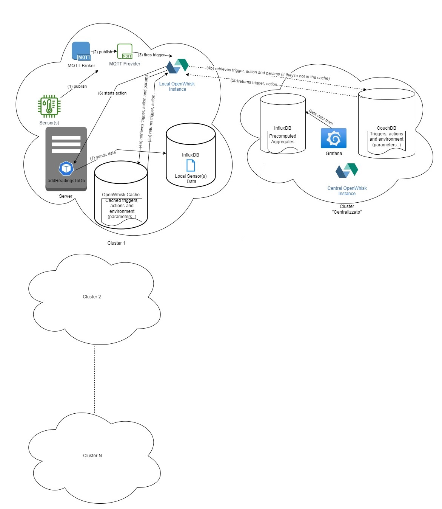
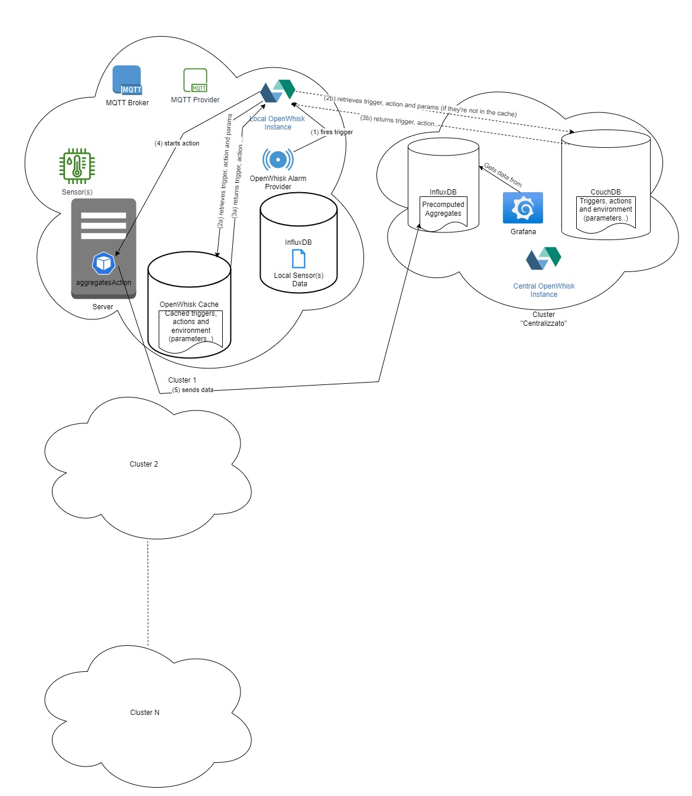

# OPENWHISK - DEPLOY

<div style="margin-left: auto;
            margin-right: auto;
            width: 50%">

|||
|:--:|:--:|
| **Author** | Giulia Bianchi|
| **Contact** | s294547@studenti.polito.it |
</div>

1. [Introduction](#introduction)
2. [Required Tools](#required-tools)
	1. [Install the Wsk Cli](#install-the-wsk-cli)
	2. [Install yq](#install-yq)
	3. [Install helm](#install-helm)
	4. [Install traefik](#install-traefik)
3. [Overview](#overview)
	1. [Triggers and Action Mechanism](#triggers-and-action-mechanism)
4. [Explaining the parameters](#explaining-the-parameters)
5. [Edge Instance Deployment](#edge-instance-deployment)
	1. [Cluster Set Up](#cluster-set-up)
	2. [Sensors' Set Up](#sensors'-set-up)
	3. [Publishing on Other Topics](#publishing-on-other-topics)
6. [Centralized Instance Deployment](#centralized-instance-deployment)
	1. [Cluster Set Up](#cluster-set-up-1)
	2. [Grafana](#grafana)
		1. [Adding a new Panel](#adding-a-new-panel)
		2. [Adding external users](#adding-external-users)
## Introduction

This folder contains all the work related to how to develop the edge and central solutions based on Openwhisk.

You will find four sub-folders:
1. [central]: it contains everything necessary to deploy the central instance.
2. [edge]: it contains everything necessary to deploy the edge instance[s].
3. [helm-charts]: it contains the necessary helm charts to deploy the solutions (all of them are saved in a specifi helm repository, from which they are retrieved).
4. [parameters]: it contains a file where we can set the most important parameters, without touching the value files used when deploying helm charts. It is highly recommended to avoid modifying them, this should be done only by the general admin. 

**IMPORTANT**: the edge instances can be deployed just after the correct deployment of the centralized instance.

## Required Tools

To be able to deploy the centralized or the edge solution, the provided scripts will have to be executed on a linux machine/container/pod and the cluster must already have the following tools/resources:

- The KubeConfig file must be present and must refer to the cluster we are working on.
- *kubectl*
- helm
- yq 
- wsk-cli
- traefik

We assume that at least the Kubernetes configuration is already present in the cluster.

### Install the wsk-cli

Here are the steps to follow to install the wsk-cli:

```
curl -L -O https://github.com/apache/openwhisk-cli/releases/download/1.1.0/OpenWhisk_CLI-1.1.0-linux-amd64.tgz
mkdir wsk-cli
tar -xvzf OpenWhisk_CLI-1.1.0-linux-amd64.tgz -C wsk-cli
sudo ln -s $HOME/wsk-cli/wsk /usr/local/bin/wsk
```

### Install yq

Here are the steps to follow to install yq:

```
sudo add-apt-repository ppa:rmescandon/yq
sudo apt-get install yq
```

### Install helm

Here are the steps to follow to install helm:

```
curl https://baltocdn.com/helm/signing.asc | sudo apt-key add -
sudo apt-get install apt-transport-https --yes
echo "deb https://baltocdn.com/helm/stable/debian/ all main" | sudo tee /etc/apt/sources.list.d/helm-stable-debian.list
sudo apt-get update
sudo apt-get install helm
```

### Install traefik

We must install traefik in our cluster if it is not present.

```
helm install traefik chartmuseum/traefik -n traefik --set global.domain_name=<cluster_domain_name> --set global.ipv4_address=<cluster_ipv4_address>
```

## Overview



Let's present our use case: we are supposing to have multiple clusters, in particular multiple data centers, in which we want to monitor the temperature, gas percentual and humidity, so that we can constantly keep track its "health". 

Each data center has one or more ESP8266 provided with humidty, temperature and gas sensors. They publish data on given topics to a *local* MQTT broker, which is developed in the cluster as a pod. We'd like to write the published data on a local InfluxDB database everytime a new recording is done, but we don't want to do that with a container or a pod. This statement can be enforced by the fact that:

1. Scalability: OpenWhisk actions are designed to scale automatically based on the incoming workload. This means that as your sensor data grows, OpenWhisk can easily handle the increased load without requiring additional infrastructure or configuration. Running pods can also scale, but it requires more manual management, especially when dealing with multiple clusters.
2. Cost efficiency: By using OpenWhisk actions, you can leverage serverless computing and pay only for the compute resources you use. This can be more cost-efficient than running pods, which require managing and paying for the underlying infrastructure regardless of usage.

These are great advantages, but to understand better the advantages of the solution we have to go a little bit deeper in our solution. 

As we said, in **each** data center we have some sensors that publish data on given topics to a *local* MQTT broker, while a MQTT provider listens if data are published. When this is done, the provider fires a trigger interaction with the local OpenWhisk instance. The trigger is used to fire an OpenWhisk action, and in our case the Openwhisk action is a function that writes the published data on a local InfluxDB iinstance.  

In our architecture we have an OpenWhisk instance for each cluster. OpenWhisk needs a CouchDB database to store data related to the created triggers, actions ecc... : all the different OpenWhisk instances share the same CouchDB instance, which can be found in a "managment" centralized cluster. In this way, all the instances share the same actions and triggers and they only need to be configured **ONCE** for the entire architecture!

Going back to firing a trigger, when the trigger is fired the local OpenWhisk instance has two options:

1. The trigger hasn't been fired for a long time, so it must be retrieved from the centralized CouchDB with its parameters.
2. The trigger is in the local openwhisk cache, which is automatically created when deploying openwhisk (it is also possible to decide the cache expiration time), and it is retrieved from here. This is the scenario that should happen more frequently.

We really like this fact, because, since we are in a Fog Computing scenario, we want to confine the computation on the edge clusters, contacting as less ass possible the *centralied* cluster. It is also important to note that the centralized cluster *never* contacts the edge cluster if it is not consulted by them first, this is also enforced by some Network Policies automatically deployed by OpenWhisk.

After the trigger is retrieved, the same steps are followed to obtain the the action code and parameters. Once the local OpenWhisk instance has everything needed, it decided in which *invoker* create the pod that runs the action and is destroyed immediatly after terminating it. An invoker is just an available cluster node.

So, to summarize, I would say that the strenghts of this approach in our Fog Computing environment are:

1. Edge Computing: By confining the computation on the edge clusters, this approach reduces the need for centralized processing, thus enabling faster and more efficient data processing, as well as reducing latency and bandwidth usage.
2. Cost-efficiency: The use of serverless computing and paying only for the compute resources used can be more cost-efficient than running pods, which require managing and paying for the underlying infrastructure regardless of usage.
3. Centralized Management: The use of a centralized CouchDB database for storing data related to triggers, actions, etc. enables easy management and configuration of the OpenWhisk instances across multiple clusters, reducing the need for manual management in the different local instances and reducing the risk of errors.
4. Security: The deployment of Network Policies automatically by OpenWhisk helps to enforce security policies, preventing unauthorized access to edge clusters, while enabling data exchange and processing within the authorized nodes.
5. Performance: OpenWhisk's caching mechanisms can improve response times and lower latency, enabling faster and more efficient processing of data at the edge.
6. Reduced Network Traffic: By leveraging caching mechanisms, less network traffic is required between edge clusters and centralized resources, reducing bandwidth usage and improving overall network efficiency.

Overall, leveraging OpenWhisk for edge device monitoring can be optimized for fog computing environments, enabling computation to be confined on the edge clusters and minimizing communication with centralized resources.



Another functionality has been implemented: some aggregates are computed every helf an hour on the collected data for each local cluster and they are finally sent on a InfluxDB database on the centralized cluster. The operation of computing the aggregates is done with some actions also in this case and the trigger related to them is fired with an Alarm Provider, which is natively provided when deployin OpenWhisk.

Finally, I've also given the possibility to have a visual representation of the aggregates computed for each data center, deploying Grafana on the centralized instance. In the Grafana instance there will be just a Grafana dashboard, with multiple panels to show the different types of aggregate data for each data center. It possible to select the specific data center thanks to a template variable. 

I could have also deployed a Grafana dashboard for each data center, but I preferred to deploy just a centralized dashboard: in this way, if there is the necessity to add some aggregate data, there is no need to modify all the local instances, but just the centralized one.

While it's true that adding new dashboards to a centralized instance every time a new edge OpenWhisk instance is added can be a bit more work, it's still easier than updating multiple local deployments every time a new aggregate is added. Additionally, having a centralized instance allows you to have a more consistent and cohesive view of your data across all the edge OpenWhisk instances, making it easier to compare and analyze the data.

Furthermore, using a centralized Grafana instance also has the advantage of making it easier to manage user access and permissions to the dashboards. Instead of having to manage access for each local deployment, you can manage access in one place, making it more efficient and secure.

All the needed charts will be retrieved from a helm repository.

### Triggers and Action Mechanism

To enable our use case, we need to use OpenWhisk triggers and actions. A trigger is an event source that can be used to invoke a specific action in OpenWhisk. In our use case, we use an MQTT trigger (taken from [here](https://blog.zhaw.ch/splab/2019/03/15/building-a-sample-mqtt-based-application-on-openwhisk/)) to listen to the MQTT broker for new data, and when new data is published, the trigger fires and invokes an OpenWhisk action.

The MQTT trigger is created using the MQTT package, which provides an easy way to listen to an MQTT broker. The trigger is configured to listen to a specific MQTT topic and to fire when new data is published on that topic. When the trigger fires, it sends a message to the OpenWhisk platform, which then invokes the associated action *addReadingToDb*.

The OpenWhisk action is the code that gets executed when the trigger is fired. In our use case, the action is responsible for writing the new data to a local InfluxDB instance. The action is written in JavaScript and is deployed as a Docker container. OpenWhisk automatically scales the number of containers based on the incoming workload, making it easy to handle increased load without requiring additional infrastructure or configuration.

When the trigger fires, the OpenWhisk platform decides in which invoker to create a new container for the action. The invoker is a node in the cluster that is available to run the container. Once the container is created, it runs the code of the action, writes the data to the InfluxDB instance, and then terminates.

In addition to the trigger that we previously discussed, there is another trigger in our OpenWhisk system that uses the alarm package. This trigger fires an action every 30 minutes to compute aggregates of data stored in the database.

The alarm package is a native OpenWhisk package that provides a simple way to schedule periodic invocations of an action. It uses a cron-like syntax to specify the timing of the invocation, and can be used to trigger actions at regular intervals.

In our case, we are using the cron parameter of the alarm package to specify that the action should be triggered every 30 minutes. The action that is triggered by this package computes aggregates of data stored in the database, such as average temperature readings or total energy usage.

The action that is triggered by this package is implemented using JavaScript and the Node.js runtime. It connects to the local InfluxDB, retrieves the necessary data, and performs the required computations to generate the aggregates. Once the computation is complete, the action can store the results in the centralized InfluxDB instance.

The name of the action that is triggered by the alarm package is aggregatesAction. This action is registered in our OpenWhisk system and can be invoked manually if necessary. However, the primary purpose of this action is to be triggered automatically by the alarm package every 30 minutes to keep our aggregated data up to date.

The trigger and action mechanism in OpenWhisk provides a highly scalable and cost-efficient way to handle the incoming data from multiple sensors. With this approach, we can easily handle an increased workload without having to manage additional infrastructure or configuration, making it ideal for our use case in a Fog Computing environment.

## Explaining the parameters

In the folder *parameters* we'll find the file [parameters.yml](./parameters/parameters.yml) containing the most important parameters. In the deployment scripts, those parameters will be used to set the parameters in the different value files. 

Those values should only be modified by the general administrator. If some values need to be changed, it is possible that we'll need to deploy again the edge and centralized instances, in order to have consistence and have a working solution. 

I will now explain all the different parameters:

**releaseName** : the release name of the edge/centralized instance.

**couchdb.username** : username to have access to couchdb database.
**couchdb.password** : password to have access to couchdb database.
**couchdb.svcPort** : the port on which the couchdb service is exposed internally in the cluster
**couchdb.gateway** : the name of the cocuhdb gateway service, it can be accessed externally from the cluster if it is followed by ".domainName".
**couchdb.extPort** : the port on which the couchdb service is exposed externally.
**couchdb.uuid** : the unique uuid of the database. It can be generated using: curl https://www.uuidgenerator.net/api/version4 2>/dev/null | tr -d -

**mosquitto.username** : the username to access the mqtt broker.
**mosquitto.password** : the password to access the mqtt broker, in 
**mosquitto.plainPassword** : the mqtt broker password in sha512-pbkdf2 format, generated with *mosquitto_passwd*.
**mosquitto.mosquittoPort** : the port used to expose the mqtt broker inside the cluster.
**mosquitto.providerPort** : the port used to expose the mqtt provider inside the cluster.


**influxdb.edge.token**: influxdb token for the edge deployments.
**influxdb.edge.username**: influxdb username for the edge deployments.
**influxdb.edge.password**: influxdb password for the edge deployments.
**influxdb.edge.bucket**: influxdb default bucket for the edge deployments.
**influxdb.edge.org**: influxdb organization for the edge deployments.


**influxdb.central.token**: influxdb token for the centralized deployment.
**influxdb.central.username**: influxdb username for the centralized deployment.
**influxdb.central.password**: influxdb password for the centralized deployment.
**influxdb.central.bucket**: influxdb default bucket for the centralized deployment.
**influxdb.central.org**: influxdb organization for the centralized deployment.

**influxdb.central.externalUrl**: it is used to name the iroute for the influxdb centralized deployment. The iroute will be accessible using *https://this field.domainName*.


**grafana.username**: grafana username.
**grafana.password**: grafana openwhisk.
**grafana.extUsername**: grafana username for external users with no administrative rights.
**grafana.extPassword**: grafana password for external users with no administrative rights.


**openwhisk.guestAuth**: openwhisk guest authentication token.


**domain_name**: domain name for the centralized instance.


**chartmuseum.link**: field used to reach the chartmuseum service exposed by the iroute. The service will be accessible using *https://this field.domainName*. 

## Edge Instance Deployment

To have a correctly working system, we need to:
1. Set up the cluster with all the required tools and services (openwhisk, influxdb, ecc..)
2. Set up the sensors to properly collect data, connect to a Wi-Fi network and to communicate with the local mosquitto broker.


### Cluster Set Up

All the necessary data/files and tools to deploy the edge instance can be found in the folder *[edge](./edge/)*. 

To deploy the edge instance, we must run the script *[deploy.sh](./edge/deploy.sh)*. In particular, we must run the following command:

```
./deploy.sh <instance-namespace>
```

Inside the *[edge](./edge/)* folder, you will find a detailed explanation of the script and of all the other resources that are inside it.

### Sensors' Set Up

In the folder [./edge/sensors](./edge/sensors/) there are two different arduino projects to set up an ESP8266 sensor provided with a gas, humidity and temperature sensor.

First, when using sensors inside a data center, we'll need to run the code that writes in the EEPROM of the board the location ID, which will be sent together with the data to the MQTT broker. 

To do that, the local data center administrator should modify [this code](./edge/sensors/store_datacenterID_eeprom/), setting the variable *dataCenterID* with an unsigned integer that represents the data center  ID.

After that, before uploading the [code responsible for sending telemetry to the MQTT broker](./edge/sensors/send_telemetry/send_telemetry.ino), the local data center administrator should make some modifications on the following variables, to be sure that the solution works:

**ssid**: it should contain the value of the Wi-Fi SSID.
**password**: it should contain the value of the Wi-FI password.
**mqtt_broker**: the master node IP of the cluster (the one that is used to reach NodePort services).
**topic**: the mqtt topic name.
**mqtt_username**: the mqtt username, which can be found in [this file](./parameters/parameters.yml) with name *.mosquitto.username*.
**mqtt_password**: the mqtt password, which can be found in [this file](./parameters/parameters.yml) with name *.mosquitto.plainPassword*.
**mqtt_port**: the external NodePort on which the mosquitto service is exposed outside the cluster. 

It can be retrieved using:
```
kubectl get svc mosquitto -o=jsonpath='{.spec.ports[0].nodePort}' -n <release-namespace>
```

### Publishing on Other Topics

By default, the sensors publish data on the topic called *test* and the MQTT provider listens for messages that are published on that topic. If we want for some reason to change the code of the sensors and let them publish messages in another topic, we need to configure the local MQTT provider to listen on that topic. To do that, we must run the following command:

```
wsk trigger create /guest/<new_trigger_name> --feed /guest/mqtt/mqtt_feed -p topic '<topic-name>' -p url "http://<mosquittoUsername>:<mosquittoPassword>@<releaseName>-mosquitto:<mosquittoPort>" -p triggerName '/guest/feed_trigger' -i
wsk rule create <newRuleName> '/guest/<new_trigger_name>' addReadingToDb -i
```

## Centralized Instance Deployment

To have a correctly working system, we need to:
1. Set up the cluster with all the required tools and services (openwhisk, influxdb, ecc..)
2. Manage grafana, in order to add dashbaords or add users.


### Cluster Set Up

All the necessary data/files and tools to deploy the edge instance can be found in the folder *[central](./central/)*. 

To deploy the edge instance, we must run the script *[deploy.sh](./central/deploy.sh)*. In particular, we must run the following command:

```
./deploy.sh <instance-namespace>
```

Inside the *[central](./central/)* folder, you will find a detailed explanation of the script and of all the other resources that are inside it.

### Grafana

When deploying the centralized solution, a Grafana instance is also deployed. Using the provided garfana chart a Grafana Dashboard to monitor aggregate data is created: this dashboard has a template variable to select the desired data center and has three panels (Gas Percentage, Humidity Percentage, Temperature) where the average, maximum and minimum values are shown, each of them is computed every half an hour with an OpenWhisk action.

The grafana dashboard is exposed at the address **https://grafana.<release-namespace>.<domain_name>**

The admin can access Grafana using the admin username and password provided in [this file](./parameters/parameters.yml) under *.grafana.username* and *.grafana.password*.

With the provided [script](./central/deploy.sh) to deploy the centralized instance, a default external user is also created with read-only rights. Its username and password are provided in [this file](./parameters/parameters.yml) under *.grafana.extUsername* and *.grafana.extPassword*. This profile should be used by the local data centers' administrator.

#### Adding a new panel

If for some reason there is the necessity to add a new panel for a new kind of measure, this must be done by the "centralized" admin, updating the grafana dashboard. After having updated the grafana dashboard, the admin may want to update the helm chart. To do that, we must follow these steps:

1. Updating the GrafanaDashboard: after having created the new dashboard, we must click on the *Dashboard Settings* icon, which is at the top-right side of the page. Then, in the left *Settings* list, we must select *JSON Model* and copy it. In the *templates* folder of the *grafana* helm chart, we'll then update the *json* section with the copied one.

2. Updating the helm chart: the centralized admin will keep the helm chart locally or save it in a personal helm repository. To make a persistent update, the admin has to run:

```
helm upgrade --install grafana <path-to-new-grafana-helm> -f <path-to-values>
```

#### Adding external users

If for some reason the centralized admin needs to add some users, it should run this command:

```
curl -X POST -H 'Content-Type: application/json' -d '{"name":"<name>", "login":"<username>", "password":"<password>" }' https://<adminusername>:<adminpassword>@grafana.<releaseNamespace>.<domainName>/api/admin/users
```